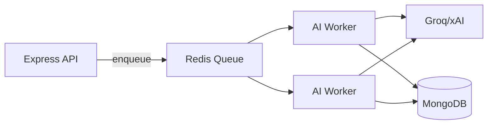

# AI Quiz Platform — Complete Interview Handbook

> **Purpose:** Study this document end-to-end before any FAANG, product company, or startup interview where you discuss this project. Every answer is grounded in your **actual codebase** — not generic interview templates.
>
> **Repo:** `github.com/jayramgit94/Ai_Quiz` | **Stack:** React 19 + Express 5 + MongoDB + Grok/Groq AI | **Deploy:** Vercel (serverless API + static SPA)

---

# TABLE OF CONTENTS

1. [Project Deep Dive](#section-1--project-deep-dive)
2. [Complete Project Architecture](#section-2--complete-project-architecture)
3. [100 Most Likely Technical Questions](#section-3--100-most-likely-technical-questions)
4. [Project Defense Questions (50+)](#section-4--project-defense-questions)
5. [Failure & Challenge Stories (STAR)](#section-5--failure--challenge-stories)
6. [HR Interview Preparation](#section-6--hr-interview-preparation)
7. [System Design Round](#section-7--system-design-round)
8. [Resume Cross-Examination](#section-8--resume-cross-examination)
9. [Technology Mastery](#section-9--technology-mastery)
10. [Rapid Revision Sheet](#section-10--rapid-revision-sheet)

---

# SECTION 1 — PROJECT DEEP DIVE

## Project Overview

### What Problem It Solves

Most interview-prep tools fall into two broken camps:

1. **MCQ quiz apps** — test recall, not communication. You can pick "B" correctly but cannot explain *why* under pressure.
2. **Mock interview tools** — feel realistic but give weak analytics. You get a vague "good job" with no topic-level weakness tracking.

**AI Quiz** bridges that gap. It is a full-stack platform where users practice **four distinct interview modes** — adaptive MCQ quizzes, live open-ended technical interviews, resume-driven mock interviews, and document/question-bank interviews — all with structured scoring, progress dashboards, and gamification to build daily habits.

### Why It Was Built

You built it because you personally felt the gap between "I know the answer" and "I can defend the answer in a real interview." Static question banks do not simulate speaking, follow-up pressure, or confidence calibration. You wanted one system that:

- Generates personalized content (topic-based or resume-based)
- Evaluates both objective (MCQ) and subjective (spoken/text) answers
- Tracks growth over time with actionable metrics (weak topics, speed, confidence calibration)

### Target Users

| Persona | What they get |
|---------|---------------|
| **College students** (placements) | Topic-wise quizzes, daily challenges, leaderboard motivation |
| **Early-career SWE candidates** | Live interview mode with speech input, resume-based questions |
| **Self-learners** | Dashboard with accuracy history, topic heatmaps, achievement unlocks |
| **Admins/mentors** | Admin panel with user analytics, interview session drill-down |

### Business Value

- **For users:** Faster interview readiness — practice + feedback + measurable progress in one product instead of juggling 3–4 tools.
- **For you as a portfolio piece:** Demonstrates full-stack ownership, AI integration with guardrails, production-minded middleware (rate limits, caching, health checks), and real UX across 12+ routes.

### Key Features (What Actually Exists in Code)

| Feature | Route / Module | Backend |
|---------|----------------|---------|
| AI MCQ quiz generation | `/setup` → `/quiz` | `POST /api/quiz/generate` |
| Adaptive difficulty + confidence scoring | `/score` | `utils/scoring.js` |
| Live open-ended interview (speech + camera) | `/interview` | `POST /api/interview/start`, `/answer` |
| Resume mock interview (PDF/DOCX upload) | `/resume-interview` | `POST /api/resume-interview/*` |
| Document/question-bank interview | `/document-interview` | `POST /api/document-interview/*` |
| Leaderboard (today / all-time / by topic) | `/leaderboard` | `GET /api/leaderboard/*` |
| Daily challenge (shared questions per UTC day) | `/daily` | `GET /api/leaderboard/daily-challenge` |
| User dashboard + history merge | `/dashboard` | `GET /api/leaderboard/progress/me` |
| Auth + XP/streak/achievements | `/login`, `/register` | `POST /api/auth/*` |
| User reviews on landing page | Landing hero | `GET /api/reviews/hero` |
| Admin analytics | `/admin` | `GET /api/admin/*` |

### Core Workflow (End-to-End)

```
User lands on / → registers → picks a mode:

QUIZ FLOW:
  /setup (topic, difficulty, count)
    → POST /quiz/generate (AI + validation + sessionId)
    → /quiz (answer with confidence + timer per question)
    → POST /quiz/submit (scoring)
    → POST /leaderboard/add + POST /auth/record-quiz (XP, history)
    → /score (results + next difficulty recommendation)

LIVE INTERVIEW FLOW:
  /interview (topic, difficulty, camera/mic optional)
    → POST /interview/start (first open-ended question)
    → user speaks/types answer
    → POST /interview/answer (AI evaluation + follow-up question)
    → loop until max questions → POST /auth/record-interview

RESUME INTERVIEW FLOW:
  /resume-interview → upload PDF/DOCX
    → POST /resume-interview/upload (extract + AI parse)
    → POST /resume-interview/generate-questions
    → per-question evaluate + anti-cheat logging
    → POST /resume-interview/complete (AI summary + grade)

DOCUMENT INTERVIEW FLOW:
  /document-interview → upload Q&A document
    → rule-based + AI extraction of question-answer pairs
    → evaluate against provided answer or AI-generated ideal answer
    → complete + summary
```

### Architecture Overview (30-Second Version)

> "It's a modular monolith — React SPA on the front, Express API on the back, MongoDB for persistence, and a dedicated `grokService.js` for all AI calls. Security and performance are handled at the middleware layer: Helmet, CORS allowlist, layered rate limits, compression, request timeouts, and an in-memory response cache with request coalescing. The API exports as a serverless function on Vercel via `api/index.js`."

### Architecture Overview (2-Minute Version)

The frontend is a Create React App SPA with React Router v6. Twelve route-level pages cover every workflow. Shared state lives in `AuthContext` (JWT user) and `ToastContext` (notifications). All HTTP goes through a centralized Axios client with auth interceptors and global 401 handling.

The backend bootstraps in `server/index.js`: security middleware first, then three-tier rate limiting (general API, AI endpoints, auth endpoints), then lazy MongoDB connection per request (with `bufferCommands: false` for serverless). Eight route modules handle domain logic. AI is never called from routes directly for complex flows — everything goes through `services/grokService.js`, which auto-detects Groq (`gsk_`) vs xAI (`xai-`) API keys.

Data is stored in seven Mongoose models. `User` is the aggregate root for gamification and rolled-up analytics. Session fidelity is preserved in `QuizSession`, `ResumeInterview`, and `DocumentInterview`. Leaderboard reads are cached; writes invalidate cache prefixes.

### Natural Interview Opener

> "I built AI Quiz because practicing MCQs alone doesn't make you interview-ready. My platform combines adaptive AI quizzes, live spoken interviews, and resume/document-driven mocks — with real scoring analytics, not just right-or-wrong. I own the full stack: React frontend, Express API, MongoDB, Grok/Groq integration with validation guardrails, and Vercel deployment."

---

# SECTION 2 — COMPLETE PROJECT ARCHITECTURE

## 2.1 Frontend

### What

React 19 SPA (Create React App, `react-scripts 5.0.1`) with 12 routed pages, 2 context providers, 1 Navbar component, and a centralized API service.

### Why React (Not Next.js / Vue)

| Factor | Your choice | Reason |
|--------|-------------|--------|
| Interactivity | React | Heavy client state: timers, speech recognition, quiz progression |
| Auth model | SPA + JWT | No SSR needed; all pages behind client-side auth checks |
| Velocity | CRA | Faster MVP; no App Router learning curve during build phase |
| Ecosystem | React Router + Framer Motion | Page transitions, icon library (lucide-react) |

**Tradeoff:** No built-in SSR/SEO for authenticated flows — acceptable because core value is behind login. First-load bundle could be optimized with code-splitting (not yet implemented).

### Component Structure

```
client_side/src/
├── App.js              # Router, theme toggle, page animations (Framer Motion)
├── index.js            # ReactDOM entry
├── components/
│   └── Navbar.js       # Navigation, theme toggle, auth-aware links
├── context/
│   ├── AuthContext.js  # JWT user state, login/logout, token verification
│   └── ToastContext.js # Global toast notifications
├── pages/              # One page per route (12 pages)
│   ├── LandingPage.js
│   ├── AuthPage.js
│   ├── QuizSetup.js → QuizScreen.js → ScoreScreen.js
│   ├── InterviewMode.js
│   ├── ResumeInterview.js
│   ├── DocumentInterview.js
│   ├── DashboardPage.js
│   ├── LeaderboardPage.js
│   ├── DailyChallenge.js
│   ├── AchievementsPage.js
│   └── AdminPage.js
├── services/
│   └── api.js          # Axios instance + all API method exports
└── styles/
    └── global.css      # CSS variables, light/dark theme via data-theme
```

### State Management

| State type | Where | Pattern |
|------------|-------|---------|
| Auth user + token | `AuthContext` | Context + `localStorage` persistence |
| Quiz session | `QuizScreen` local state | `useState` + `useRef` for timer |
| Interview session | `InterviewMode` local state | Phase machine: SETUP → INTERVIEW → RESULTS |
| Theme | `App.js` | `localStorage` + `document.documentElement.dataset.theme` |
| Server data | Per-page `useEffect` fetch | No Redux — intentional simplicity |

**Why no Redux/Zustand:** Each workflow is self-contained. Shared auth is the only cross-cutting state. Adding a global store would be over-engineering for current scope.

### Routing

React Router v6 with `BrowserRouter`. Routes defined in `App.js` → `AnimatedRoutes`. Page transitions via Framer Motion `AnimatePresence` with `mode="wait"`.

| Path | Page | Auth required? |
|------|------|----------------|
| `/` | Landing | No |
| `/login`, `/register` | Auth | No |
| `/setup`, `/quiz`, `/score` | Quiz flow | Soft (works as Guest) |
| `/interview` | Live interview | Soft |
| `/resume-interview`, `/document-interview` | File interviews | Yes (upload routes use `authMiddleware`) |
| `/dashboard`, `/achievements` | Progress | Yes (for full data) |
| `/leaderboard`, `/daily` | Social | No |
| `/admin` | Admin panel | Separate admin JWT |

### Performance Optimization (Current + Gaps)

**Implemented:**
- Axios timeouts (120s default, 180s for uploads)
- `useCallback` / `useRef` in InterviewMode to stabilize speech recognition hooks
- CSS-based theming (no JS re-render on theme switch beyond state toggle)
- Production build via `react-scripts build` served as static files on Vercel CDN

**Not yet implemented (say this honestly in interviews):**
- Route-level `React.lazy()` code splitting
- Memoization on dashboard chart components
- Service worker / PWA offline (manifest exists but basic)

### Responsiveness

Each page has dedicated CSS (`*.css` co-located). Global CSS uses CSS variables for theming. Layout is mobile-aware but not fully tested on all breakpoints — be honest if asked.

### Accessibility

- Lucide React SVG icons (not emoji — migrated in commit `6a3a574`)
- Form labels on auth pages
- **Gap:** Speech recognition fallback to textarea exists; full ARIA audit not done

---

## 2.2 Backend

### API Architecture

**Pattern:** Modular monolith — one Express app, domain-separated routers.

```
server/
├── index.js                 # Bootstrap, middleware, DB connect, route mounting
├── routes/
│   ├── auth.js              # JWT auth, profile, record-quiz/interview, clear-data
│   ├── quiz.js              # Generate, submit, session, expand-topic
│   ├── interview.js         # Live open-ended start/answer
│   ├── resume-interview.js  # Upload, generate, evaluate, complete, anti-cheat
│   ├── document-interview.js
│   ├── leaderboard.js       # Rankings, progress, daily challenge
│   ├── reviews.js           # Hero reviews, publish
│   └── admin.js             # Admin login, overview, user drill-down
├── services/
│   └── grokService.js       # ALL AI calls (Groq + xAI auto-detect)
├── models/                  # 7 Mongoose schemas
└── utils/
    ├── scoring.js           # Quiz score formulas
    ├── validation.js        # Anti-hallucination MCQ validator
    ├── responseCache.js     # In-memory cache + in-flight coalescing
    └── documentInterview.js # Rule-based Q&A parsing + semantic similarity
```

### Folder Structure Rationale

- **Routes** = HTTP contract only (validate input, call service, persist, respond)
- **Services** = external integrations (AI API)
- **Utils** = pure deterministic logic (scoring, parsing, caching)
- **Models** = data shape + indexes + schema methods

This separation is interview gold: *"I can unit-test scoring without mocking HTTP."*

### Business Logic Highlights

| Domain | Key logic | File |
|--------|-----------|------|
| Quiz scoring | `finalScore = accuracy * 0.7 + speedScore * 0.3` | `scoring.js` |
| Adaptive difficulty | ≥80% accuracy → harder; <40% → easier | `scoring.js` |
| Confidence calibration | Overconfidence errors, guess accuracy | `scoring.js` |
| MCQ validation | 4 options, valid letter, no duplicates, explanation ≥10 chars | `validation.js` |
| Live answer gate | min words: easy=1, medium=2, hard=4 | `interview.js` |
| Resume parse | AI structured JSON from raw text (max 6000 chars) | `grokService.js` |
| Document extract | Rule-based parser + AI fallback, merged | `documentInterview.js` |
| Daily challenge | UTC day-of-year topic rotation + upsert lock | `leaderboard.js` |
| XP/achievements | 13 achievement types, streak by date diff | `User.js` model method |

### Middleware Stack (Order Matters)

```
1. helmet()                    — security headers
2. compression()               — gzip responses
3. cors({ origin: allowlist }) — dev localhost + CLIENT_URL + VERCEL_URL
4. trust proxy                 — for correct IP behind Vercel
5. rateLimit /api/             — 600 req/15min (prod)
6. rateLimit AI routes         — 80 req/min
7. rateLimit auth login/register — 20 req/15min
8. express.json({ limit: 10mb })
9. request timeout             — 290s (matches Vercel maxDuration 300)
10. connectDB middleware       — per /api request (except /health)
11. route handlers
12. global error handler       — hides stack in production
```

### Authentication

**User auth:** Email + bcrypt password (12 rounds) → JWT signed with `JWT_SECRET`, 7-day expiry. Token in `Authorization: Bearer` header.

**Admin auth:** Separate `POST /api/admin/login` with `ADMIN_USERNAME` / `ADMIN_PASSWORD` env vars → JWT with `{ role: "admin" }`, 24h expiry. Admin routes check `payload.role === "admin"`.

**Client handling:** Axios interceptor injects token; on 401 (non-admin routes) clears storage and redirects to `/login`. Admin 401 does NOT auto-redirect (prevents UX loops on `/admin`).

### Authorization

| Endpoint | Guard |
|----------|-------|
| `/auth/me`, `/auth/profile`, `/auth/record-*`, `/auth/clear-data` | `authMiddleware` |
| `/leaderboard/add`, `/leaderboard/progress/me` | `authMiddleware` |
| `/resume-interview/upload`, document upload | `authMiddleware` |
| `/reviews` POST | `authMiddleware` |
| `/admin/*` (except login, status) | `adminAuth` (role check) |
| `/quiz/generate`, `/interview/*` | **No auth** (by design — guest quiz works) |

**Interview talking point:** Quiz/interview generation is public to lower friction; resume upload requires auth because it stores PII.

### Error Handling

1. **Route-level:** try/catch → specific status (400, 401, 404, 409, 500)
2. **Global:** `app.use((err, req, res, next) => ...)` — generic message in production
3. **Graceful degradation:** Quiz generation saves to DB in try/catch — if DB fails, quiz still returns to client
4. **Health endpoint:** Returns `{ status: "ok" | "degraded", db: "connected" | "disconnected" }`

### Validation

| Layer | Examples |
|-------|----------|
| Input | Email regex, password ≥6, topic required, file type whitelist |
| AI output | `validateQuestionSet()` — rejects malformed MCQs before serving |
| Business | Duplicate quiz submit blocked (`session.completed` → 409) |
| Destructive | `clear-data` requires password re-verification |

---

## 2.3 Database

### Schema Design (7 Collections)

#### User (aggregate root)
- **Identity:** email (unique), password hash, displayName, avatar, country
- **Gamification:** xp, level, streak, lastActiveDate, achievements[]
- **Stats:** totalQuizzes, totalCorrect, totalQuestions, totalInterviews, bestAccuracy
- **Analytics:** topicStats[], accuracyHistory[] (capped at 100), quizHistory[] (capped at 150), interviewHistory[] (capped at 120)
- **Live pointer:** currentInterview { sessionId, type, status }
- **Methods:** `comparePassword`, `calculateLevel`, `addXP` (streak + achievements)
- **Index:** `{ xp: -1 }`

#### QuizSession
- sessionId (unique, indexed), userName, topic, difficulty
- questions[], answers[], score vector, confidenceStats, completed flag
- **Indexes:** `{ userName, createdAt }`, `{ topic }`

#### ResumeInterview
- Full resume parse (skills, projects, experience, education)
- Generated questions with category (technical/behavioral/project/hr)
- Per-response evaluation vectors (relevance, depth, communication, semanticSimilarity)
- antiCheating { tabSwitches, fullscreenExits, warnings[] }
- results { overallScore, grade, summary, interviewReady }
- **TTL index:** incomplete sessions auto-delete after 7 days

#### DocumentInterview
- sourceDocument.extracted[] with Q/A pairs
- Similar response/evaluation structure to resume
- **TTL index:** same 7-day cleanup for incomplete

#### LeaderboardEntry
- userName, score, accuracy, speedScore, finalScore, topic, difficulty, date
- **Indexes:** `{ date: -1, finalScore: -1 }`, `{ userName, topic }`

#### DailyChallenge
- date (unique, "YYYY-MM-DD"), topic, difficulty, questions[]
- Generated once per day with concurrency lock (`withDailyChallengeLock`)

#### Review
- userId, displayName, email, rating (1-5), note (max 600 chars)

### Relationships

```
User (1) ──→ (many) QuizSession        [via userName string match + userId on interviews]
User (1) ──→ (many) ResumeInterview    [userId ref + userName fallback]
User (1) ──→ (many) DocumentInterview  [userId ref + userName fallback]
User (1) ──→ (many) Review             [userId ref]
User (1) ──→ (many) LeaderboardEntry   [via userName — not userId FK]
DailyChallenge (standalone per date)
```

**Design choice:** Leaderboard uses `userName` not `userId` — simpler for guest quizzes but can break if user renames displayName. Know this tradeoff.

### Normalization vs Denormalization

| Denormalized (intentional) | Why |
|--------------------------|-----|
| quizHistory embedded in User | Fast dashboard reads without joins |
| Full question snapshots in history | Audit trail — questions may not exist elsewhere |
| displayName on Review | Avoid populate on hero feed |

| Normalized (separate collections) | Why |
|-----------------------------------|-----|
| QuizSession, ResumeInterview, DocumentInterview | Large payloads; TTL on incomplete; admin drill-down |

### Query Optimization

- `.lean()` on read-heavy routes (leaderboard, admin, progress)
- `.select()` to exclude password and limit fields
- `Promise.all` for parallel fetches in `/progress/me` and admin overview
- `mergeByKey` utility deduplicates history from User doc + session collections
- Indexes on sessionId, date, userName, topic, xp

### Indexing Tradeoffs

**Pro:** Fast leaderboard sorts, session lookups, email uniqueness  
**Con:** Write amplification on every leaderboard insert; embedded arrays grow unbounded (mitigated by slice caps: 100/120/150)

### Database Tradeoffs (MongoDB vs PostgreSQL)

| MongoDB (your choice) | PostgreSQL alternative |
|-----------------------|------------------------|
| Flexible nested AI payloads | Strict schema, better for analytics SQL |
| Fast document reads for sessions | JOINs for dashboard would be cleaner |
| TTL indexes for cleanup | Cron job + DELETE WHERE |
| Weaker transactional guarantees across collections | ACID for multi-table updates |

**Your honest answer:** "MongoDB matched evolving AI response shapes early. At scale I'd add a read replica for analytics and consider PostgreSQL for leaderboard aggregations."

---

## 2.4 Deployment

### Hosting

**Vercel** — configured in `vercel.json`:
- Frontend: `client_side/build` (static)
- API: `api/index.js` → re-exports `server/index.js` as serverless function
- `maxDuration: 300` seconds for AI-heavy requests
- Rewrites: `/api/*` → serverless function; `/*` → `index.html` (SPA)

### CI/CD

No GitHub Actions in repo — deployment is Vercel Git integration (push to main → build). Build command: `cd client_side && npm install && npm run build`. Install: `cd server && npm install`.

**Commits show iterative hardening:**
- `2a00bf4` — Add Vercel deployment config
- `85ae32e` — CORS fix for Vercel preview URLs
- `7fa964f` — Fix unused vars for Vercel build
- `1dba99b` — API resilience, caching, concurrency controls

### Environment Variables

| Variable | Purpose |
|----------|---------|
| `GROK_API_KEY` | Groq (`gsk_`) or xAI (`xai-`) — auto-detected |
| `MONGODB_URI` | Atlas or local connection string |
| `JWT_SECRET` | Required in production (process.exit if missing) |
| `CLIENT_URL` | Comma-separated CORS origins |
| `ADMIN_USERNAME`, `ADMIN_PASSWORD` | Admin panel credentials |
| `TRUST_PROXY` | `true` for Vercel IP detection |
| `API_RATE_LIMIT_MAX`, `AI_RATE_LIMIT_MAX`, `AUTH_RATE_LIMIT_MAX` | Tunable limits |
| `REQUEST_TIMEOUT_MS` | Default 290000 |
| `MONGODB_*` | Pool size, timeouts for serverless |

### Monitoring (Current State)

**Implemented:** `GET /api/health` with DB status, console.error on route failures  
**Not implemented (say you'd add):** Sentry, structured logging (pino), APM, uptime alerts

### Security (Production Checklist)

| Control | Status |
|---------|--------|
| Helmet headers | ✅ |
| CORS allowlist | ✅ (incl. `ai-quiz*.vercel.app` regex) |
| Rate limiting (3 tiers) | ✅ |
| JWT secret required in prod | ✅ |
| bcrypt cost 12 | ✅ |
| Password gate on clear-data | ✅ |
| File type + size limits (10-12MB) | ✅ |
| NoSQL injection guard (`escapeRegex`) | ✅ |
| API keys server-side only | ✅ |
| Refresh tokens / token revocation | ❌ (future) |
| HTTPS | ✅ (Vercel default) |

---

# SECTION 3 — 100 MOST LIKELY TECHNICAL QUESTIONS

> Format: **Q** → **Intent** → **Answer (60–90 sec)** → **Follow-ups** → **Red flags**

---

## BEGINNER (20 Questions)

### B1. What does your project do in one sentence?

**Intent:** Can you communicate clearly under pressure?

**Answer:** AI Quiz is a full-stack interview-prep platform where users practice adaptive AI-generated quizzes, live open-ended technical interviews, and resume or document-based mock interviews — with scoring, progress tracking, and gamification so preparation feels closer to a real interview than a static question bank.

**Follow-ups:** Who is the target user? What makes it different from LeetCode?

**Red flags:** "It's a quiz app with React." No mention of interview modes or AI evaluation.

---

### B2. What is your tech stack?

**Intent:** Baseline technical literacy.

**Answer:** Frontend is React 19 with React Router, Axios, Framer Motion, and Lucide icons — built with Create React App. Backend is Node.js with Express 5 and Mongoose on MongoDB. AI goes through Grok or Groq APIs depending on the key format. Auth is JWT with bcrypt. File uploads use Multer with pdf-parse and Mammoth for text extraction. Deployed on Vercel as a serverless API plus static SPA.

**Follow-ups:** Why not Next.js? Why MongoDB?

**Red flags:** Listing technologies without explaining what each does in *your* project.

---

### B3. Walk me through what happens when a user starts a quiz.

**Intent:** End-to-end flow understanding.

**Answer:** User picks topic, difficulty, and question count on `/setup`, then navigates to `/quiz`. The client calls `POST /api/quiz/generate` with those params. The server expands subtopics via AI, generates MCQs, runs them through a validation layer — four options, valid answer letter, no duplicates — creates a `sessionId`, saves a `QuizSession`, and returns questions. The user answers each question with a confidence level while a per-question timer runs. On finish, `POST /api/quiz/submit` calculates accuracy, speed score, and final score. If logged in, we also hit leaderboard and `record-quiz` for XP and history.

**Follow-ups:** What if AI returns bad questions? What if the user double-submits?

**Red flags:** Skipping validation or session persistence.

---

### B4. How does user authentication work?

**Intent:** Basic security awareness.

**Answer:** Registration stores email and bcrypt-hashed password in MongoDB. Login compares the hash and returns a JWT signed with `JWT_SECRET`, valid for seven days. The React app stores the token in localStorage. Axios interceptors attach `Authorization: Bearer` on every request. On 401, we clear auth state and redirect to login — except for admin API calls, which don't auto-redirect to avoid loops on the admin page.

**Follow-ups:** Why localStorage and not httpOnly cookies? How do you handle token expiry?

**Red flags:** "Passwords are stored securely" without mentioning bcrypt or JWT.

---

### B5. What is the difference between quiz mode and live interview mode?

**Intent:** Feature comprehension.

**Answer:** Quiz mode is objective — AI generates four-option MCQs, correctness is deterministic by comparing answer letters, and we score accuracy plus speed. Live interview mode is subjective — AI generates open-ended questions with no options. The user speaks or types answers, and we evaluate semantic quality against expected topics and a reference answer. Each answer triggers a follow-up question that builds on prior context. Quiz mode has confidence tracking; interview mode has speech recognition and optional camera.

**Follow-ups:** Why deterministic MCQ grading but AI grading for open-ended?

**Red flags:** Treating both modes as identical.

---

### B6. What database collections do you have?

**Intent:** Data modeling basics.

**Answer:** Seven collections: `User` for identity and gamification aggregates; `QuizSession` for quiz attempts; `ResumeInterview` and `DocumentInterview` for mock interview sessions; `LeaderboardEntry` for score snapshots; `DailyChallenge` for one shared quiz per UTC day; and `Review` for user testimonials on the landing page.

**Follow-ups:** Why separate session collections instead of everything in User?

**Red flags:** Only naming User and Quiz.

---

### B7. How do you call the AI API?

**Intent:** Integration understanding.

**Answer:** All AI calls go through `server/services/grokService.js`. It auto-detects the API key — Groq keys start with `gsk_`, xAI keys with `xai-` — and hits the appropriate chat completions endpoint. Routes never call axios to the AI provider directly. The service handles prompt construction, JSON parsing with markdown stripping, validation, and fallback extraction when the model wraps JSON in code blocks.

**Follow-ups:** What model do you use? What happens on timeout?

**Red flags:** "We use AI" with no mention of service layer or key protection.

---

### B8. What is JWT and why did you use it?

**Intent:** Auth mechanism depth.

**Answer:** JWT is a signed token the server issues after login. The payload contains `userId`. The client sends it on every request. The server verifies the signature with `JWT_SECRET` — no database lookup per request for basic auth. I chose it because the API is stateless, which fits horizontal scaling and Vercel serverless instances. Tradeoff: no built-in revocation until expiry — I'd add refresh tokens at scale.

**Follow-ups:** How would you invalidate a compromised token?

**Red flags:** Confusing JWT with encryption or sessions.

---

### B9. What is Mongoose and what does it do in your project?

**Intent:** ODM familiarity.

**Answer:** Mongoose is the MongoDB ODM for Node. I define schemas for each collection — field types, enums, defaults, indexes. It gives me pre-save hooks like password hashing on User, instance methods like `comparePassword` and `addXP`, and query helpers. I also set `bufferCommands: false` for serverless so Mongoose doesn't queue operations while disconnected — that was causing 10-second timeouts on Vercel.

**Follow-ups:** What indexes did you add and why?

**Red flags:** "Mongoose connects to MongoDB" with no schema detail.

---

### B10. What pages exist in your React app?

**Intent:** Frontend scope awareness.

**Answer:** Twelve routes: Landing, Login/Register, Quiz Setup, Quiz Screen, Score Screen, Live Interview, Resume Interview, Document Interview, Dashboard, Leaderboard, Daily Challenge, Achievements, and Admin. Navigation is in a shared Navbar. Page transitions use Framer Motion. Theme toggles between light and dark via CSS variables on `document.documentElement`.

**Follow-ups:** Which page was hardest to build?

**Red flags:** Missing interview or admin pages.

---

### B11. How is the final quiz score calculated?

**Intent:** Can you explain your own business logic?

**Answer:** Accuracy is correct answers divided by total, as a percentage. Speed score starts at 100 and decreases based on average time per question — roughly two points lost per second above a ten-second baseline, capped zero to one hundred. Final score is seventy percent accuracy plus thirty percent speed. I also compute confidence stats — overconfidence errors when someone picks "high confidence" but gets it wrong, and guess accuracy when they mark "guess."

**Follow-ups:** Why 70/30 weighting? How does adaptive difficulty work?

**Red flags:** "We calculate the score in the backend" without formulas.

---

### B12. What is adaptive difficulty in your app?

**Intent:** Product logic depth.

**Answer:** After each quiz, `calibrateDifficulty` in `scoring.js` looks at accuracy. If it's eighty percent or above, difficulty bumps up — easy to medium, medium to hard. Below forty percent, it drops. Between forty and eighty, it stays the same. The recommended `nextDifficulty` is shown on the score screen so users know what to pick next. It's rule-based, not ML — simple and explainable.

**Follow-ups:** Would you use ML for this eventually?

**Red flags:** Claiming ML when it's threshold rules.

---

### B13. What is the daily challenge?

**Intent:** Feature awareness.

**Answer:** Every UTC day, one shared quiz is generated for all users. The topic rotates through a fixed pool of fifteen CS topics based on day-of-year modulo. First request of the day triggers AI generation, validates questions, and upserts into `DailyChallenge` with a concurrency lock so parallel requests don't create duplicates. Subsequent requests read from cache and DB. Users compete on the same questions that day.

**Follow-ups:** How do you prevent duplicate generation under load?

**Red flags:** Not knowing about `withDailyChallengeLock` or upsert.

---

### B14. What is gamification in your project?

**Intent:** Engagement feature understanding.

**Answer:** Users earn XP after quizzes and interviews — base ten XP per quiz plus bonuses for high accuracy and hard difficulty. Interviews give twenty-five base plus score bonuses. XP drives level — floor of XP divided by one hundred plus one. Streaks track consecutive active days. Thirteen achievements unlock automatically — first quiz, five quizzes, perfect score, three-day streak, level five, first interview, and more. Achievements are checked inside `user.addXP()` on every XP event.

**Follow-ups:** How do you prevent XP farming?

**Red flags:** Only mentioning leaderboard without XP/achievements.

---

### B15. How does the leaderboard work?

**Intent:** Read path + write path.

**Answer:** After quiz submit, the client calls `POST /api/leaderboard/add` with userName, score, accuracy, speedScore, finalScore, topic, and difficulty. That creates a `LeaderboardEntry`. Reads hit `GET /today`, `/all`, or `/topic/:topic` — sorted by finalScore, limited to fifty or one hundred. GET responses are cached ten to fifteen seconds with in-memory middleware. Writes invalidate cache prefixes so new scores appear quickly.

**Follow-ups:** Why cache leaderboard reads? What about cheating?

**Red flags:** No mention of finalScore formula or caching.

---

### B16. What is Multer used for?

**Intent:** File upload knowledge.

**Answer:** Multer handles multipart file uploads for resume and document interviews. It validates file extension — PDF, DOC, DOCX — enforces size limits of ten to twelve megabytes, stores temporarily to `/tmp/uploads` on Vercel or `server/uploads` locally, then we extract text and delete the file. The actual resume content lives in MongoDB as parsed text, not as a stored file.

**Follow-ups:** Why delete files after extraction? Security concerns?

**Red flags:** "Multer uploads files to the database."

---

### B17. What is CORS and how did you configure it?

**Intent:** Cross-origin security basics.

**Answer:** CORS controls which browser origins can call my API. In production I allow origins from `CLIENT_URL` env var, Vercel's auto-injected `VERCEL_URL`, and a regex for `ai-quiz*.vercel.app` preview deployments. In dev, any localhost port works. Requests with no origin — like curl or Postman — are allowed. Blocked origins get a console warning and CORS error.

**Follow-ups:** What happens if CORS is misconfigured on Vercel preview?

**Red flags:** "CORS is enabled" without allowlist strategy — you fixed this in commit `85ae32e`.

---

### B18. What is the health endpoint for?

**Intent:** Ops awareness.

**Answer:** `GET /api/health` returns JSON with status ok or degraded, database connected or disconnected, and a timestamp. It tries to connect to MongoDB but still responds if DB is down — so load balancers and uptime monitors get a signal without hanging. It's excluded from rate limiting so monitoring doesn't get throttled.

**Follow-ups:** How would you alert on degraded status?

**Red flags:** Not knowing the endpoint exists.

---

### B19. How do you deploy the application?

**Intent:** DevOps basics.

**Answer:** Vercel hosts both frontend and API. `vercel.json` builds the React app to `client_side/build`, installs server dependencies, and routes `/api/*` to `api/index.js` which re-exports the Express app. SPA routes fall through to `index.html`. Serverless function max duration is three hundred seconds for long AI calls. Environment variables are set in Vercel dashboard — MongoDB URI, JWT secret, Grok API key, admin credentials.

**Follow-ups:** Local dev vs production differences?

**Red flags:** "I deploy to GitHub" without mentioning Vercel or serverless.

---

### B20. What was your first commit vs what exists now?

**Intent:** Growth narrative; git awareness.

**Answer:** First commit was the initial scaffold. Since then — roughly fifteen commits — I added Vercel deployment, replaced emojis with Lucide icons, built document interview and review workflows, admin panel, live interview speech scoring, dashboard history merge, API caching with concurrency locks, CORS hardening for preview URLs, and CI build fixes for unused variables and hook dependencies. The project evolved from a working prototype to something I'd defend in a production interview.

**Follow-ups:** What would you commit next?

**Red flags:** Claiming the project was perfect from day one.

---

## INTERMEDIATE (40 Questions)

### I1. Explain your anti-hallucination validation for quiz questions.

**Intent:** AI reliability engineering.

**Answer:** AI models sometimes return malformed MCQs — three options, wrong answer letter, duplicate choices. I have two layers. First, `parseQuizJSON` in grokService filters structurally invalid questions and deduplicates. Second, `validateQuestionSet` in validation.js enforces exactly four options, valid A-D correctAnswer, explanation at least ten characters, no duplicate option text, and minimum question length. If zero questions pass, the API returns 500 with "please try again" — we never show broken content to users. I added this after seeing users get quizzes with mismatched answer keys.

**Follow-ups:** Retry logic? JSON mode from provider?

**Red flags:** "We trust the AI output."

---

### I2. Why is MCQ correctness evaluated deterministically but interview feedback uses AI?

**Intent:** Engineering judgment on when to use LLMs.

**Answer:** For MCQ in interview-style mode, correctness is a letter comparison — `userAnswer.charAt(0) === correctAnswer.charAt(0)`. AI only generates educational feedback and follow-up questions, not the pass/fail decision. That's because asking an LLM "is this correct?" is unreliable — it can hallucinate agreement. For open-ended answers there's no ground truth without semantic judgment, so AI evaluation is appropriate — but I still gate on minimum word count before calling the model, and blend AI score with semantic similarity signals.

**Follow-ups:** How do you measure AI evaluation quality?

**Red flags:** Using AI for everything including binary correctness.

---

### I3. Explain the resume interview pipeline end-to-end.

**Intent:** Complex flow ownership.

**Answer:** Authenticated user uploads PDF or DOCX to `POST /resume-interview/upload`. Multer saves temp file. pdf-parse or Mammoth extracts text — if under fifty characters, we reject. AI parses structured profile: skills, projects, experience, education. Session status moves parsing to ready. User triggers `generate-questions` — AI creates eight questions with distribution: forty percent technical, twenty-five project, twenty behavioral, fifteen HR. Each answer goes to `evaluate-answer` with spoken transcript, expected topics, and difficulty-aware HR rubric. Anti-cheat events log tab switches and fullscreen exits. `complete` generates an AI summary with grade and interview-ready boolean. User's `currentInterview` pointer clears on completion.

**Follow-ups:** PII handling? Image-based PDFs?

**Red flags:** "Upload resume, AI asks questions" with no extraction or validation detail.

---

### I4. How does document interview differ from resume interview?

**Intent:** Feature differentiation.

**Answer:** Resume interview generates questions from the candidate's profile — skills and projects drive question content. Document interview ingests an existing question bank. I run a rule-based parser in documentInterview.js that detects question lines, Q/A prefixes, and implicit prompts like "tell me about yourself." AI extraction supplements with `extractQuestionAnswerPairsWithAI`. Results merge with preference for entries that have provided answers. Evaluation compares user answers against the document's answer key if present, otherwise AI generates an ideal answer. Document mode also has local semantic similarity via cosine, Jaccard, and Levenshtein token matching as a supplement to AI scoring.

**Follow-ups:** Why both rule-based and AI parsing?

**Red flags:** Treating them as the same upload flow.

---

### I5. Explain your Axios interceptor design.

**Intent:** Frontend architecture patterns.

**Answer:** Single axios instance with baseURL `/api` — works locally via CRA proxy to port 5000 and in production via Vercel rewrite. Request interceptor reads token from localStorage and sets Authorization header unless the request already has one — admin calls pass explicit tokens. Response interceptor catches 401, clears token and user, redirects to login unless already on auth pages or hitting admin routes. I use a redirect guard flag to prevent multiple simultaneous redirects. Timeouts are 120 seconds default, 180 seconds for file uploads.

**Follow-ups:** Race conditions on token refresh?

**Red flags:** Token logic duplicated in every component.

---

### I6. What is request coalescing in your cache?

**Intent:** Concurrency pattern knowledge.

**Answer:** In responseCache.js, when multiple identical GET requests arrive before the first completes, the second request waits on the same in-flight Promise instead of hitting MongoDB again. When the first resolves, all waiters get the same payload. This prevents cache stampede — especially on daily challenge and leaderboard endpoints where traffic spikes at once. Cache entries have TTL, max five hundred entries, and LRU-style eviction when full.

**Follow-ups:** Problem with in-memory cache on serverless?

**Red flags:** "We cache responses" without stampede awareness.

---

### I7. Why `bufferCommands: false` on Mongoose?

**Intent:** Serverless-specific debugging — strong signal you hit real issues.

**Answer:** By default Mongoose buffers operations when disconnected and retries for up to ten seconds. On Vercel serverless, cold starts mean the first request might arrive before connection completes. Buffering made handlers hang until timeout instead of failing fast. Setting `bufferCommands: false` and `bufferTimeoutMS: 0` plus explicit `connectDB()` middleware per request gives predictable 503 responses when DB is down and avoids silent queuing.

**Follow-ups:** Connection pooling on serverless?

**Red flags:** Never heard of buffering issue.

---

### I8. Explain the User.addXP achievement system.

**Intent:** Business logic in model methods.

**Answer:** `addXP` increments XP, recalculates level, updates streak by comparing lastActiveDate to today — increment if yesterday, reset if gap greater than one day, no change if same day. Then it iterates thirteen achievement definitions with check functions — first quiz, five quizzes, perfect score, streak milestones, level milestones, first interview, thousand XP. Already-unlocked IDs are skipped via a Set. New achievements return to the client for toast display. This keeps gamification logic colocated with user data instead of scattered in routes.

**Follow-ups:** Race condition if two quizzes complete simultaneously?

**Red flags:** Achievements stored only on frontend.

---

### I9. How does `/leaderboard/progress/me` merge history?

**Intent:** Data integration complexity.

**Answer:** Authenticated endpoint loads user profile with embedded quizHistory and interviewHistory. In parallel it queries QuizSession, ResumeInterview, and DocumentInterview collections by userId and displayName regex. Mapper functions normalize each source to a common shape. `mergeByKey` deduplicates by sessionId, keeping the newest timestamp. Same for interviews keyed by type plus sessionId. Topic history comes from user.topicStats enriched with latest difficulty from LeaderboardEntry. This gives dashboard a complete picture even if record-quiz failed once but session was saved.

**Follow-ups:** Why duplicate storage in User and sessions?

**Red flags:** "Dashboard reads from User only."

---

### I10. Explain live interview speech recognition.

**Intent:** Browser API integration depth.

**Answer:** InterviewMode uses the Web Speech API — `webkitSpeechRecognition` or `SpeechRecognition`. Interim results show in real-time; final results append to answer text. I use refs for recording state to avoid stale closures in recognition callbacks — that was a real bug fixed for CI. Minimum word counts gate submission by difficulty. Text-to-speech reads questions aloud when enabled. Camera stream is optional for mock realism. Tab visibility and fullscreen exit listeners feed anti-cheat warnings.

**Follow-ups:** Browser compatibility? Accuracy of speech-to-text?

**Red flags:** Assuming speech recognition works everywhere — it doesn't on all browsers.

---

### I11. What rate limits did you implement and why three tiers?

**Intent:** Abuse prevention design.

**Answer:** General API: six hundred requests per fifteen minutes in production. AI routes — quiz generate, interview, resume, document — eighty per minute because each hits external LLM and costs money. Auth login and register: twenty per fifteen minutes against brute force. Health endpoint is skipped. Limits are env-configurable. Separate tiers because a user doing ten quizzes is fine for general limit but expensive for AI limit.

**Follow-ups:** Distributed rate limiting across serverless instances?

**Red flags:** No rate limiting or single global limit for everything.

---

### I12. How do you handle duplicate quiz submission?

**Intent:** Idempotency awareness.

**Answer:** QuizSession has a `completed` boolean. On submit, if already true, return 409 Conflict. Frontend should disable submit button after click — but server-side guard is the real protection against double-click or retry. Leaderboard and record-quiz can still duplicate if client retries those — I'd add idempotency keys there next.

**Follow-ups:** What about network timeout after successful submit?

**Red flags:** Only client-side prevention.

---

### I13. Explain admin authentication vs user authentication.

**Intent:** Authorization separation.

**Answer:** Users authenticate with email/password, JWT contains userId. Admins authenticate with separate username/password from env vars, JWT contains role admin. Admin middleware checks role, not userId. Admin token expires in twenty-four hours vs seven days for users. Frontend admin page stores admin token separately and passes explicit Authorization header — admin 401 doesn't trigger global logout redirect. Admin overview aggregates all users, top XP, recent signups, reviews, seven-day active count.

**Follow-ups:** Security of default admin password in code?

**Red flags:** Same auth flow for admin and users.

---

### I14. What is `escapeRegex` used for?

**Intent:** Security detail — NoSQL injection.

**Answer:** User-provided strings like displayName or topic get used in MongoDB `$regex` queries for case-insensitive matching. Special regex characters in a username like `.*` could broaden queries unexpectedly. `escapeRegex` backslash-escapes metacharacters before building the RegExp. Used in progress endpoints and topic leaderboard.

**Follow-ups:** Why regex instead of exact match?

**Red flags:** Never considered injection in regex queries.

---

### I15. How does topic expansion work?

**Intent:** AI feature beyond basic generation.

**Answer:** Before generating quiz questions, `expandTopic` calls AI with the keyword and asks for five to eight subtopics as a JSON array. Those subtopics are passed into the generation prompt so questions cover breadth not just the surface keyword. If expansion fails, we log a warning and generate from the raw topic — graceful degradation.

**Follow-ups:** Cache expanded topics?

**Red flags:** Not knowing this step exists.

---

### I16. Explain confidence scoring.

**Intent:** Behavioral analytics depth.

**Answer:** Each quiz answer includes confidence: high, medium, or guess. `calculateConfidenceStats` counts overconfidence errors — high confidence plus wrong answer. Guess accuracy tracks how often guesses are correct. Calibration score weights high-confidence correct answers positively and high-confidence wrong answers negatively. This tells users if they're reliably self-aware — important for interview prep where overconfidence hurts.

**Follow-ups:** How would you visualize this on dashboard?

**Red flags:** Confidence is just UI decoration with no backend use.

---

### I17. What happens when Grok API key is missing?

**Intent:** Config validation.

**Answer:** `getApiConfig` throws if key is missing or still set to placeholder `your_grok_api_key_here`. Routes catch this and return 500 with a meaningful error. In production, missing `JWT_SECRET` actually calls `process.exit(1)` on boot — fail fast. API key errors surface per-request for AI routes.

**Follow-ups:** Secret rotation strategy?

**Red flags:** Silent failure or empty quizzes.

---

### I18. Why Express 5?

**Intent:** Dependency awareness.

**Answer:** The project uses Express 5.2 — largely API-compatible with Express 4 but with improved routing and promise handling. I didn't need NestJS overhead for a single-developer project. Express gives direct middleware control for my custom stack — CORS callback, tiered rate limits, DB connect guard.

**Follow-ups:** When would you migrate to Fastify or Nest?

**Red flags:** Can't explain why Express over alternatives.

---

### I19. How does the review system work?

**Intent:** Secondary feature completeness.

**Answer:** Authenticated users submit rating one to five and note minimum eight characters via `POST /api/reviews`. Server pulls displayName and email from User doc, creates Review document. Hero endpoint returns latest twelve reviews, cached twenty seconds. Publishing invalidates hero cache prefix. Landing page displays these as social proof.

**Follow-ups:** Moderation? Spam prevention?

**Red flags:** Didn't know reviews exist.

---

### I20. Explain `getStrictnessConfig` for interview evaluation.

**Intent:** AI prompt engineering detail.

**Answer:** Difficulty drives evaluation strictness. Easy: minimum one word, blend weight 0.55 toward AI score. Medium: two words, 0.68. Hard: four words, 0.8. Higher blend weight means we trust the AI evaluator more on harder modes. Below minimum words, we return zero score locally without calling AI — saves cost and gives instant feedback. HR rubric strings also change per difficulty — supportive on easy, strict senior-panel tone on hard.

**Follow-ups:** How did you tune these weights?

**Red flags:** Same evaluation for all difficulties.

---

### I21–I30 (Condensed — same depth in interview)

| # | Question | Core answer hook |
|---|----------|------------------|
| I21 | How is password hashing done? | bcrypt pre-save hook, cost 12, `comparePassword` method |
| I22 | What is `trust proxy` for? | Correct client IP behind Vercel for rate limiting |
| I23 | Why compression middleware? | Smaller JSON payloads for leaderboard/history |
| I24 | How does clear-data work? | DELETE with password re-verify; wipes stats not account |
| I25 | TTL index on interviews? | 7-day auto-delete for incomplete sessions; controls storage |
| I26 | Daily challenge topic selection? | `dayOfYear % 15` from DAILY_TOPICS array — deterministic per UTC day |
| I27 | Framer Motion usage? | Page enter/exit animations; `AnimatePresence mode="wait"` |
| I28 | Guest vs logged-in quiz? | Quiz works without auth; record-quiz/leaderboard need login for persistence |
| I29 | How are weak/strong topics computed? | Per-subtopic accuracy in quiz; ≥70% strong, <50% weak |
| I30 | Vercel `includeFiles: server/**`? | Bundles server code into serverless function deployment |

### I31. How would you test this project?

**Intent:** Quality mindset.

**Answer:** Currently no automated tests in package.json — honest gap. I'd add: unit tests for scoring.js and validation.js — pure functions, easy wins; integration tests for auth and quiz submit with mongodb-memory-server; contract tests for AI JSON schema with mocked grokService; E2E with Playwright for quiz happy path. CI would run on PR before Vercel deploy.

**Red flags:** Claiming full test coverage that doesn't exist.

---

### I32. What is the hardest bug you fixed?

**Intent:** Debugging story — use InterviewMode hook fix.

**Answer:** CI build failed on InterviewMode because `useEffect` dependencies were unstable — speech recognition callbacks closed over stale state, and eslint flagged missing deps. I refactored to use refs for `answerText`, `interimTranscript`, and `isRecording` so recognition handlers always read current values without re-subscribing on every keystroke. Commit `3dc30cf`. Separately, CORS blocked Vercel preview URLs until I added regex for `ai-quiz*.vercel.app`.

**Follow-ups:** How did you find it?

**Red flags:** Generic "fixed a bug" with no specifics.

---

### I33–I40 (Intermediate batch 2)

| # | Question | Answer essence |
|---|----------|----------------|
| I33 | Semantic similarity in document mode? | `compareAnswers`: cosine + Jaccard + key term coverage + Levenshtein soft match |
| I34 | Why caps on history arrays? | Prevent unbounded User document growth — 100/120/150 limits |
| I35 | `mergeExtractedQuestionAnswers` logic? | Rule-based pairs merged with AI pairs; prefer entries with answers |
| I36 | Anti-cheat limitations? | Logs tab switch/fullscreen exit only — not proctoring; honest about scope |
| I37 | Why UUID for sessionId? | `crypto.randomUUID()` — no collision, no sequential guessing |
| I38 | POST vs GET for quiz generate? | Mutation + AI cost — must not be cacheable GET |
| I39 | How does dashboard get interview data? | progress/me merges User.interviewHistory + Resume + Document collections |
| I40 | Environment parity local vs prod? | `.env` locally; Vercel env vars; `VERCEL` flag changes upload path to /tmp |

---

## ADVANCED (40 Questions)

### A1. How would you scale this to 10x traffic without rewriting?

**Intent:** Practical scaling thinking.

**Answer:** Short term: move in-memory cache to Redis Upstash so serverless instances share cache and rate limit state. Add MongoDB Atlas M10 with read preference secondary for leaderboard queries. Put Cloudflare CDN in front of static assets. Queue AI generation jobs with BullMQ — return sessionId immediately, poll for questions. Keep modular monolith — don't microservice prematurely. Add connection pooling tuning and monitor Vercel function duration p99.

**Follow-ups:** When do you split services?

**Red flags:** "Just add more servers" with no specific bottlenecks.

---

### A2. What's wrong with in-memory cache on Vercel serverless?

**Intent:** Serverless architecture depth.

**Answer:** Each function instance has its own memory. Cache hit on instance A misses on instance B. In-flight coalescing only helps within one instance. TTL eviction is per-instance so effective hit rate is low. Worse — rate limits from express-rate-limit are also per-instance unless using Redis store. That's why production scale needs external Redis for shared state. My current cache still helps for burst traffic hitting the same warm instance.

**Follow-ups:** Vercel KV vs Upstash?

**Red flags:** Claiming in-memory cache works globally.

---

### A3. Design idempotency for record-quiz and leaderboard add.

**Intent:** Distributed systems maturity.

**Answer:** Accept `Idempotency-Key` header or use sessionId as natural key. Store processed keys in Redis with twenty-four hour TTL or unique compound index on userId plus sessionId in a ProcessedEvents collection. On duplicate, return 200 with original response instead of double-incrementing XP. Leaderboard add should check if sessionId already has an entry before insert.

**Follow-ups:** Exactly-once semantics possible?

**Red flags:** No awareness of duplicate side effects.

---

### A4. How do you prevent prompt injection in interview answers?

**Intent:** AI security.

**Answer:** User answers are embedded in evaluation prompts as candidate content, not system instructions. I instruct the model not to hallucinate facts absent from the answer and to score meaning not exact wording. Risk remains — attacker could say "ignore previous instructions." Mitigations I'd add: input length caps, delimiter fencing like `"""candidate"""`, output schema validation, and monitoring anomalous scores. Not fully solved in v1 — acknowledge honestly.

**Follow-ups:** Red team testing?

**Red flags:** "We sanitize input" without specifics.

---

### A5. JWT without refresh token — production risk?

**Intent:** Auth depth.

**Answer:** Seven-day tokens mean stolen token is valid for a week. No server-side revocation without a denylist. For interview app with moderate sensitivity, acceptable for MVP. Production hardening: short-lived access token fifteen minutes, refresh token in httpOnly cookie, rotate on use, store refresh token hash in DB for revocation. clear-data and password change should invalidate all sessions.

**Follow-ups:** Why not sessions with Redis?

**Red flags:** "JWT is secure" without tradeoff discussion.

---

### A6. MongoDB transaction for quiz submit + record-quiz?

**Intent:** Data consistency.

**Answer:** Currently separate API calls from client — not atomic. User could submit quiz, get scores, but record-quiz fails — session completed but XP not awarded. Mitigation today: progress/me merges from QuizSession. Better design: single `POST /quiz/complete` that scores, updates session, creates leaderboard entry, and updates user in one transaction or saga. MongoDB multi-doc transactions work on replica set but add latency — worth it for financial-grade consistency, debatable for gamification XP.

**Follow-ups:** Saga vs transaction?

**Red flags:** Unaware of split-call consistency gap.

---

### A7. Evaluate your leaderboard using userName not userId.

**Intent:** Schema critique acceptance.

**Answer:** Tradeoff from supporting guest quizzes and simple client payloads. Breaks if user changes displayName — old entries orphan. Duplicate names possible — regex match can conflate users. Fix: add userId to LeaderboardEntry when authenticated, keep userName for display, migrate guest entries. Index on userId plus date.

**Red flags:** Defending blindly without acknowledging flaw.

---

### A8. How would you add observability?

**Intent:** Production engineering.

**Answer:** Structured JSON logs with requestId middleware correlating quiz sessionId. Metrics: AI latency histogram, validation failure rate, cache hit ratio, 503 rate from DB. Sentry for error tracking with user context scrubbed. Vercel analytics for Web Vitals. Alert when health degraded more than two minutes or AI error rate exceeds five percent. Trace AI calls end-to-end with OpenTelemetry.

**Follow-ups:** What to alert on first?

**Red flags:** console.log only.

---

### A9. AI cost optimization strategies for your app.

**Intent:** Business-aware engineering.

**Answer:** Rate limits already cap abuse. Further: cache generated quizzes by topic plus difficulty hash for one hour; batch subtopic expansion with generation; use smaller model for validation tasks; skip AI call when word count below threshold — already done; pre-generate daily challenge off-peak via cron; stream responses only where UX benefits; track tokens per user for quota tiers.

**Follow-ups:** Groq vs xAI cost difference?

**Red flags:** Ignoring AI cost entirely.

---

### A10. Sharding strategy if User collection hits millions?

**Intent:** Database scale theory applied.

**Answer:** User doc with embedded histories is the growth risk — shard Users by userId hash range. Move quizHistory to separate collection entirely — already partially done with QuizSession. LeaderboardEntry shards by date range — hot shard for today. DailyChallenge is single doc per day — no shard needed. Interview sessions shard by userId for locality. Analytics go to warehouse — BigQuery or ClickHouse — via change streams.

**Follow-ups:** When to shard vs restructure?

**Red flags:** "MongoDB auto-shards" without schema thought.

---

### A11–A20 (Advanced batch — technical depth)

| # | Question | Elite answer hook |
|---|----------|-------------------|
| A11 | Circuit breaker for AI API? | Open after N failures; fail fast with cached fallback questions bank |
| A12 | Why 290s timeout? | Vercel max 300s; leave margin; AI calls timeout at 300s in axios |
| A13 | GDPR for resume data? | rawText stored in MongoDB; need consent, deletion endpoint, encryption at rest |
| A14 | WebSocket for interview? | Not used — request/response sufficient; WS for real-time proctoring later |
| A15 | Compare monolith vs microservices for this | Monolith correct at current scale; extract AI worker first if anything |
| A16 | Event-driven refactor? | Publish QuizCompleted event → leaderboard, XP, analytics consumers |
| A17 | CAP theorem in your system? | AP toward availability — quiz works if DB save fails; eventual consistency on stats |
| A18 | Denormalization risk on User | Document size limit 16MB; array caps mitigate; monitor avg doc size |
| A19 | Alternative to speech API | Whisper API batch, or MediaRecorder + upload |
| A20 | Load test plan? | k6 on /quiz/generate and /leaderboard/today; find AI and DB breaking points |

### A21. Walk through cold start on Vercel.

**Intent:** Serverless mechanics.

**Answer:** First request spins up function, loads Express app, `connectDB` runs — MongoDB handshake maybe one to three seconds. `bufferCommands false` means no silent wait. Warm requests reuse connection pool up to maxPoolSize ten. `includeFiles server/**` ensures all routes and models bundle. Mitigation: provisioned concurrency on Vercel Pro, keep-alive pings on health endpoint, optimize bundle size.

---

### A22–A40 (Advanced final batch)

| # | Question | Key point |
|---|----------|-----------|
| A22 | Race on daily challenge upsert? | `withDailyChallengeLock` + findOneAndUpdate upsert |
| A23 | bcrypt cost 12 — why? | ~250ms hash; balances security vs login UX |
| A24 | Helmet breaks something? | May need CSP tuning for inline styles in CRA |
| A25 | Multi-tenant admin? | Single admin today; would add RBAC roles array on User |
| A26 | Version AI prompts? | Store promptVersion in session for debugging regressions |
| A27 | Feature flags? | Env-based toggles for document interview, daily challenge |
| A28 | Blue-green deploy? | Vercel preview URLs; promote to production |
| A29 | Database migration strategy? | Mongoose schema evolution; backfill scripts for new fields |
| A30 | Why not GraphQL? | REST fits CRUD; no client-driven nested fetch need yet |
| A31 | SSR for landing SEO? | Valid improvement — Next.js marketing site + SPA app split |
| A32 | OWASP top 10 in project? | Injection mitigated; auth gaps on public AI routes; rate limits help |
| A33 | Backup strategy? | MongoDB Atlas continuous backup; test restore quarterly |
| A34 | Horizontal vs vertical scale? | Stateless API horizontal; DB vertical then replica |
| A35 | Message queue for resume parse? | Upload returns 202, worker parses, webhook or poll — better UX for large PDFs |
| A36 | Deterministic daily challenge? | Same topic all users per day by design — fair competition |
| A37 | Cache invalidation hardest part? | Leaderboard prefix invalidation on add — solved; distributed harder |
| A38 | Testing AI outputs? | Golden file tests with mocked responses; property tests on validator |
| A39 | P99 latency budget? | AI 5-30s dominates; API overhead under 100ms without AI |
| A40 | If you rewrote today? | Keep monolith; add Redis, job queue, refresh tokens, Vitest, Next for landing |

---

# SECTION 4 — PROJECT DEFENSE QUESTIONS (50+)

> Aggressive "why not X?" questions with elite answers grounded in your implementation.

---

### D1. Why React instead of Next.js?

**Answer:** My users spend time in authenticated, interactive flows — quiz timers, speech recognition, multi-step interviews. SSR adds complexity without helping those routes. CRA let me ship faster with React Router and a simple Vercel static deploy. If I needed SEO on the landing page or server components for auth, I'd migrate marketing pages to Next.js and keep the app shell — not rewrite everything day one.

---

### D2. Why not microservices?

**Answer:** I'm a solo developer with moderate traffic. A modular monolith gives clear domain boundaries — eight route files — without network hops, distributed tracing overhead, and deployment coordination. The first thing I'd extract is an async AI worker, not six microservices. Microservices solve organizational scale problems I don't have yet.

---

### D3. Why not PostgreSQL?

**Answer:** Interview sessions carry deeply nested structures — per-question AI evaluation vectors, anti-cheat logs, parsed resume JSON. MongoDB maps naturally and let me iterate schema without migrations during rapid feature adds. I still use indexes and cap embedded arrays. At scale I'd use Postgres for leaderboard aggregations and keep Mongo for session documents — or use Postgres JSONB if starting fresh with stricter schema discipline.

---

### D4. Why not Redis from day one?

**Answer:** In-memory cache and rate limits solved the immediate problem — leaderboard stampede and read-heavy endpoints — with zero infrastructure cost on Vercel. Redis is the right next step when multiple serverless instances make per-process cache ineffective. I designed cache behind middleware so swapping to Redis store is a contained change.

---

### D5. Why not GraphQL?

**Answer:** My client has fixed workflows per page — quiz setup doesn't need flexible nested queries. REST endpoints map one-to-one with UI actions, which simplified debugging and Vercel serverless routing. GraphQL shines with many clients needing different field sets. I'd reconsider if I added mobile apps with bandwidth constraints.

---

### D6. Why not Docker?

**Answer:** Vercel abstracts runtime for this project — git push deploys without container management. Docker makes sense for self-hosted Kubernetes or consistent local prod parity. I use `npm run dev` with concurrently for local dev. For enterprise on-prem, I'd containerize the Express app with a multi-stage Dockerfile.

---

### D7. Why not JWT sessions in Redis instead of stateless JWT?

**Answer:** Stateless JWT fit Vercel's horizontal scaling without shared session store cost. Tradeoff is revocation. For this app's risk profile, seven-day expiry is acceptable MVP. Production upgrade path is refresh tokens plus Redis denylist for logout — not full session migration unless compliance requires it.

---

### D8. Why not OAuth (Google/GitHub login)?

**Answer:** Email-password was faster to implement and sufficient for a portfolio MVP. OAuth adds provider integration, account linking edge cases, and privacy policy requirements. It's on the roadmap — Passport.js or Clerk would integrate cleanly with existing JWT flow after OAuth callback.

---

### D9. Why Grok/Groq instead of OpenAI GPT-4?

**Answer:** The service layer auto-detects Groq or xAI keys — I optimized for cost and speed during development. Groq's Llama 3.3 70B is fast for MCQ generation. The abstraction in grokService means swapping to OpenAI is changing URL, model, and key — routes unchanged. Provider choice is configuration, not architecture.

---

### D10. Why not call OpenAI from the frontend?

**Answer:** API keys would leak in browser network tab. I couldn't enforce rate limits, validation, or consistent prompts. Centralizing in the backend lets me reject malformed questions before users see them and throttle expensive calls per IP.

---

### D11. Why not WebSockets for live interview?

**Answer:** Request-response fits the turn-based interview pattern — question, answer, evaluation, next question. WebSockets add connection state management on serverless — awkward on Vercel. I'd use WS for real-time collaboration or live proctoring, not current UX.

---

### D12. Why not TypeScript?

**Answer:** JavaScript let faster iteration early. The codebase is stable enough that TypeScript migration would pay off — starting with `scoring.js`, `validation.js`, and `api.js` types. Honest technical debt I'd address before team scaling.

---

### D13. Why not Prisma ORM?

**Answer:** Mongoose is idiomatic for MongoDB — schema methods like `addXP`, TTL indexes, and embedded subdocuments are first-class. Prisma's MongoDB support is improving but Mongoose matched my document-model needs and TTL on incomplete interviews.

---

### D14. Why not Firebase?

**Answer:** I wanted full control over AI orchestration, custom scoring, validation middleware, and Express patterns interviewers recognize. Firebase Auth and Firestore would speed auth but complicate complex aggregation queries for dashboard merge logic.

---

### D15. Why not Supabase?

**Answer:** Similar to Firebase — great for CRUD apps. My workload is AI-heavy with custom business logic and file parsing pipelines. Postgres via Supabase could work for User and Leaderboard while keeping AI on Express — hybrid approach viable but added vendor split.

---

### D16. Why Create React App instead of Vite?

**Answer:** CRA was default when I started; `react-scripts` proxy simplified local API dev. Vite would improve HMR and build speed — migration is incremental via craco or eject. Not a fundamental architecture decision.

---

### D17. Why not Kubernetes?

**Answer:** Massive operational overhead for a portfolio project on Vercel. K8s solves multi-region container orchestration at enterprise scale. Vercel functions plus Atlas is the right ops curve for now.

---

### D18. Why not Elasticsearch for leaderboard?

**Answer:** MongoDB sorted queries with indexes handle fifty to one hundred entries fine. Elasticsearch wins at millions of rows and complex aggregations. Premature — I'd add Redis sorted sets for real-time ranks before Elasticsearch.

---

### D19. Why not Stripe/monetization?

**Answer:** Product focus was interview prep quality, not billing. Rate limits implicitly cap free tier abuse. Adding Stripe means webhook idempotency, subscription state on User model, and feature gating — straightforward extension.

---

### D20. Why not unit tests in the repo?

**Answer:** Honest gap — prioritized feature velocity. Pure functions in scoring and validation are highest ROI test targets. I'd add Vitest before claiming production-grade in interviews.

---

### D21. Why bcrypt and not Argon2?

**Answer:** bcrypt via bcryptjs is battle-tested, built into my Mongoose pre-save hook, cost factor twelve is OWASP-acceptable. Argon2 is stronger against GPU attacks — easy swap if threat model requires.

---

### D22. Why store JWT in localStorage?

**Answer:** Simplicity with CRA SPA. XSS can steal it — mitigation is CSP, input sanitization, short-lived tokens. httpOnly cookies are better against XSS; I'd migrate with CSRF protection.

---

### D23. Why not nginx reverse proxy?

**Answer:** Vercel handles TLS, routing, and static serving. Self-hosted would use nginx in front of Node. Not applicable to current deploy target.

---

### D24. Why Mongoose 9?

**Answer:** Latest major with improved connection handling and query API. Staying current reduces security patch lag.

---

### D25. Why not tRPC?

**Answer:** tRPC couples frontend and backend in TypeScript monorepo — I'm JS on both ends without shared types package. REST plus OpenAPI spec would be middle ground for typed clients.

---

### D26. Why guest quiz without auth?

**Answer:** Reduces signup friction for first-time users — try before register. Tradeoff: can't tie session to userId without login. Leaderboard uses displayName string. Conversion funnel optimization.

---

### D27. Why not CDN for API?

**Answer:** API responses are personalized or mutating — not CDN-cacheable except maybe daily challenge with short TTL at edge. Static React build is CDN-served by Vercel.

---

### D28. Why AI for resume parsing vs regex?

**Answer:** Resumes have wildly inconsistent formats. Regex breaks on two-column PDFs and creative layouts. AI extracts structured JSON from messy text. I still validate minimum text length and fail gracefully on image-only PDFs.

---

### D29. Why delete uploaded files after parse?

**Answer:** Vercel `/tmp` is ephemeral and limited. Storing files creates liability and storage cost. Parsed text in MongoDB is sufficient for question generation. GDPR deletion is simpler.

---

### D30. Why not Terraform for infra?

**Answer:** Vercel plus Atlas configured via dashboards. Terraform valuable for multi-environment AWS setups. Would add for team with staging/prod parity requirements.

---

### D31–D55 (Rapid defense)

| # | Challenge | One-line elite response |
|---|-----------|-------------------------|
| D31 | Why not Lambda separately? | Vercel bundles API as one Express app — simpler than 20 Lambda functions |
| D32 | Why not S3 for uploads? | Parse inline; no durable file storage needed post-extraction |
| D33 | Why not Celery? | Node BullMQ is native choice for async AI jobs |
| D34 | Why not Zustand? | AuthContext sufficient; no global quiz state needed |
| D35 | Why not Storybook? | Solo project; component catalog low priority |
| D36 | Why not Cypress? | Would add Playwright for critical paths first |
| D37 | Why not monorepo Turborepo? | Two packages sufficient with npm prefix scripts |
| D38 | Why not API versioning /v1? | Single client; breaking changes manageable solo |
| D39 | Why not Swagger? | Would document OpenAPI for admin onboarding |
| D40 | Why not multi-language i18n? | English-first MVP; strings not externalized yet |
| D41 | Why not dark mode only? | User preference; theme in User model and localStorage |
| D42 | Why not native mobile app? | Web reaches all devices; speech API works on Chrome |
| D43 | Why not WebRTC for interview? | Out of scope; camera preview only, not peer connection |
| D44 | Why not RAG for questions? | Generation from LLM sufficient; RAG adds vector DB complexity |
| D45 | Why not fine-tuned model? | Prompt engineering plus validation cheaper for MVP |
| D46 | Why not event sourcing? | CRUD sessions adequate; overkill for quiz app |
| D47 | Why not CQRS? | Read/write paths not divergent enough yet |
| D48 | Why not Apache Kafka? | No high-volume event stream requirement |
| D49 | Why not GitHub Actions CI? | Vercel build is CI; would add lint/test workflow |
| D50 | Why not Dependabot? | Manual dep updates; would automate security patches |
| D51 | Why leaderboard by finalScore not accuracy? | Speed matters in interviews — composite reflects both |
| D52 | Why 7-day JWT not 1-day? | UX for returning users; trade security for convenience |
| D53 | Why admin password in env not DB? | Single admin; env vars simpler; rotate via Vercel |
| D54 | Why not block copy-paste in interview? | Anti-cheat logs only; blocking hurts legitimate notes |
| D55 | Why not use AI for daily challenge cache? | Same questions all day by design — fairness |

---

# SECTION 5 — FAILURE & CHALLENGE STORIES (STAR)

## Story 1: Biggest Challenge — AI Hallucinated Quiz Questions

**Situation:** Early users reported quizzes with three options, duplicate questions, or correct answers that didn't match any option.

**Task:** Make AI-generated content trustworthy enough to ship without manual review per quiz.

**Action:** Built two-layer validation — parseQuizJSON structural filter plus validateQuestionSet with explicit rules (4 options, letter match, explanation length, duplicate detection). Hard-fail API if zero valid questions. Tightened system prompts with "EXACTLY 4 options" and "correctAnswer must be ONLY the letter."

**Result:** Broken quizzes stopped reaching users. Validation failure rate became monitorable. Tradeoff: occasional 500 "try again" — acceptable vs showing wrong content.

---

## Story 2: Production Bug — CORS Blocked Vercel Preview Deployments

**Situation:** Preview URLs like `ai-quiz-xyz.vercel.app` couldn't call API after deployment. Login and quiz generation failed silently in browser.

**Task:** Fix CORS without opening to all origins.

**Action:** Added regex `/^https:\/\/ai-quiz[\w-]*\.vercel\.app$/` to CORS allowlist plus `VERCEL_URL` env injection. Commit `85ae32e`.

**Result:** Preview deployments work for testing. Production `CLIENT_URL` still explicit. Learned to test on preview URL not just localhost.

---

## Story 3: Scalability Issue — Daily Challenge Thundering Herd

**Situation:** Multiple simultaneous requests at UTC midnight could each trigger AI generation for the same daily challenge.

**Task:** Ensure exactly one challenge document per day.

**Action:** Implemented `withDailyChallengeLock` in-memory promise map plus MongoDB `findOneAndUpdate` upsert with `$setOnInsert`.

**Result:** One generation per day under concurrent load. Acknowledged in-memory lock is per-instance — Redis lock would be next step multi-region.

---

## Story 4: Database Problem — Mongoose Buffering Timeouts on Vercel

**Situation:** API requests hung ~10 seconds then failed on cold starts.

**Task:** Make serverless DB behavior predictable.

**Action:** Set `bufferCommands: false`, per-request `connectDB()` middleware, 503 fast-fail when disconnected, tuned `serverSelectionTimeoutMS` to 15000.

**Result:** Cold starts either connect quickly or fail with clear retry message. No silent buffering.

---

## Story 5: Team Conflict — N/A Solo Project (Reframe as Mentor Review)

**Situation:** Feedback from peer review that admin defaulted to weak password pattern in code.

**Task:** Harden admin without over-engineering.

**Action:** Moved credentials to env vars, separate admin JWT with role claim, admin 401 excluded from user logout redirect, added `/admin/status` to check configuration.

**Result:** Admin surface explicitly configured in production. Documented in `.env.example`.

---

## Story 6: Deadline Pressure — Vercel Build Failures Before Demo

**Situation:** ESLint unused variables and unstable React hooks blocked `npm run build` on Vercel.

**Task:** Ship working demo on deadline.

**Action:** Fixed unused vars (`7fa964f`), refactored InterviewMode hook dependencies (`3dc30cf`), fixed DashboardPage JSX corruption (`605d7bc`).

**Result:** CI green, demo deployed. Learned to run `npm run build` locally before every push.

---

## Story 7: Feature Failure — Image-Based Resume PDFs

**Situation:** Users uploaded scanned resume PDFs; extraction returned empty or garbage text.

**Task:** Handle gracefully without OCR infrastructure.

**Action:** Minimum text length check (50 chars), clear error message asking for text-based PDF/DOCX, status still moves to ready for retry.

**Result:** Reduced support confusion. Documented OCR as future enhancement (Tesseract or Document AI).

---

## Story 8: Security Concern — Public AI Endpoints Without Auth

**Situation:** `/quiz/generate` and `/interview/*` are unauthenticated — potential API cost abuse.

**Task:** Balance friction vs protection.

**Action:** AI-specific rate limiter 80/min, global API limit 600/15min, IP via trust proxy, env-tunable limits. Keys never exposed to client.

**Result:** Abuse risk reduced not eliminated. Would add captcha or auth-required generation for production monetization.

---

# SECTION 6 — HR INTERVIEW PREPARATION

## Tell Me About Yourself

> I'm a software engineer focused on full-stack web development and AI-integrated products. I recently built AI Quiz — an interview preparation platform that goes beyond static MCQs to include live spoken interviews and resume-based mocks with real scoring analytics. I care about shipping features that work reliably, which is why I spent significant time on validation layers, rate limiting, and deployment hardening on Vercel — not just getting AI demos working. I'm looking for roles where I can own features end-to-end and keep learning production engineering.

---

## Walk Me Through This Project (2 Minutes)

> AI Quiz solves a gap I felt personally — you can practice MCQs but still freeze in real interviews. I built four modes: adaptive AI quizzes with confidence tracking, live open-ended interviews with speech input, resume uploads that generate personalized questions, and document-based mocks from question banks.
>
> Frontend is React with a centralized Axios client. Backend is Express and MongoDB. All AI calls go through one service module supporting Groq or xAI. I added strict MCQ validation because early AI outputs were malformed. Scoring blends accuracy and speed, and the dashboard tracks weak topics over time.
>
> It's deployed on Vercel as serverless API plus static SPA. Hardest parts were serverless database connection behavior and making AI output trustworthy. If I had more time I'd add Redis caching, refresh tokens, and automated tests for scoring logic.

---

## Why Did You Build This?

> I was preparing for technical interviews and noticed most tools test recall, not explanation under pressure. I wanted one place to practice speaking answers, get feedback, and see measurable progress. Building it end-to-end taught me more than tutorials — especially around AI guardrails, file parsing, and production middleware.

---

## What Was The Hardest Part?

> Making AI output reliable. LLMs return markdown-wrapped JSON, wrong option counts, and duplicate questions. I couldn't just prompt harder — I needed programmatic validation and hard-fail behavior. Second hardest was Vercel serverless plus MongoDB — Mongoose buffering caused ten-second hangs until I reconfigured connection behavior.

---

## Biggest Mistake?

> Initially trusting AI for MCQ correctness in interview mode. The model sometimes said wrong answers were right. I fixed it by making correctness purely deterministic — letter comparison — and limiting AI to feedback and follow-ups only.

---

## Biggest Learning?

> AI features need engineering guardrails equal to the prompting. Validation, rate limits, timeouts, and fallbacks are what make AI products shippable. Prompting alone is not a product.

---

## What Would You Improve?

> Three things: Redis for shared cache and rate limits across serverless instances; async job queue for resume parsing and long AI calls; Vitest coverage on scoring.js and validation.js. Also refresh tokens and httpOnly cookies for auth.

---

## If Given 6 More Months?

> Month 1-2: Redis, queue, tests, observability. Month 3: OAuth, refresh tokens. Month 4: OCR for scanned resumes. Month 5: Mobile-responsive polish and accessibility audit. Month 6: Beta with real users, iterate on evaluation quality from feedback data.

---

## Why Should We Hire You?

> I ship complete features — not just UI mockups. AI Quiz shows I can integrate LLMs responsibly, design schemas for real analytics, handle deployment issues, and iterate from user-impacting bugs. I document tradeoffs honestly and know what's MVP vs what's production-hardening.

---

## Leadership Example

> When planning features I prioritized reliability over breadth — pushed back on adding more AI modes until validation was solid. That discipline prevented shipping broken quizzes that would kill user trust.

---

## Conflict Example

> Received feedback that guest access on AI endpoints was risky. Instead of dismissing it, I added tiered rate limits and documented the tradeoff. We agreed auth-gating could come with monetization.

---

## Ownership Example

> End-to-end ownership: UI flows, API design, MongoDB schemas, Grok integration, Vercel config, CORS debugging, admin analytics. No handoff — I debugged production issues from browser network tab to serverless logs.

---

## Failure Example

> First Vercel deploy failed CI due to hook dependency warnings I ignored locally. Missed demo buffer. Now I always run production build before push. Failure changed my pre-deploy checklist.

---

## Innovation Example

> Combined rule-based document Q&A parsing with AI extraction and merged results — hybrid approach handled messy interview doc formats better than either alone. Also confidence-weighted scoring gives behavioral insight most quiz apps skip.

---

# SECTION 7 — SYSTEM DESIGN ROUND

## 7.1 Current System Design

### Architecture Diagram

```mermaid
flowchart TB
    subgraph Client["Browser — React SPA"]
        LP[LandingPage]
        QS[QuizSetup / QuizScreen]
        IM[InterviewMode]
        RI[ResumeInterview]
        DI[DocumentInterview]
        DB[DashboardPage]
        LB[LeaderboardPage]
        AD[AdminPage]
        API_CLIENT[Axios api.js]
    end

    subgraph Vercel["Vercel Platform"]
        CDN[Static CDN — client_side/build]
        FN[Serverless Function — api/index.js]
    end

    subgraph Express["Express App — server/index.js"]
        MW[Middleware Stack<br/>helmet · cors · rateLimit · compression · timeout]
        AUTH_R[/api/auth]
        QUIZ_R[/api/quiz]
        INT_R[/api/interview]
        RES_R[/api/resume-interview]
        DOC_R[/api/document-interview]
        LB_R[/api/leaderboard]
        REV_R[/api/reviews]
        ADM_R[/api/admin]
        GROK[grokService.js]
        CACHE[responseCache.js]
    end

    subgraph External["External Services"]
        MONGO[(MongoDB Atlas)]
        AI[Groq / xAI API]
    end

    LP & QS & IM & RI & DI & DB & LB & AD --> API_CLIENT
    API_CLIENT -->|HTTPS /api/*| CDN
    CDN -->|rewrite| FN
    FN --> MW
    MW --> AUTH_R & QUIZ_R & INT_R & RES_R & DOC_R & LB_R & REV_R & ADM_R
    QUIZ_R & INT_R & RES_R & DOC_R --> GROK
    LB_R & REV_R --> CACHE
    AUTH_R & QUIZ_R & INT_R & RES_R & DOC_R & LB_R & REV_R & ADM_R --> MONGO
    GROK --> AI
```

### Data Flow — Quiz Submit

```
User selects answers → QuizScreen builds answers[] with confidence + timeTaken
  → POST /api/quiz/submit { sessionId, answers }
  → Load QuizSession by sessionId
  → Guard: if completed → 409
  → calculateScores(questions, answers)
  → Save session (score, accuracy, speedScore, finalScore, weakTopics, nextDifficulty)
  → Return results to client
  → Client: POST /leaderboard/add (if logged in)
  → Client: POST /auth/record-quiz → XP, streak, achievements, quizHistory
  → Navigate to /score
```

### User Flow — New User to First Interview

```
/ → /register → JWT stored
  → /resume-interview → upload PDF
  → parsing → AI structured profile → preview skills/projects
  → generate questions → start interview
  → speak answers → evaluate each → anti-cheat logs
  → complete → summary + grade
  → /dashboard shows interviewHistory
```

### API Flow — Daily Challenge (Read-Heavy)

```
GET /api/leaderboard/daily-challenge
  → cacheResponse middleware (15s TTL)
  → withDailyChallengeLock(today)
  → DailyChallenge.findOne({ date })
  → if miss: generateQuizQuestions → validate → upsert
  → return { topic, questions, date }
```

### Database Flow — Progress Dashboard

```
GET /api/leaderboard/progress/me [auth]
  → User.findById (topicStats, histories)
  → Parallel: QuizSession, ResumeInterview, DocumentInterview queries
  → mergeByKey(profile history, session data)
  → Enrich topic difficulty from LeaderboardEntry
  → Return unified cockpit JSON
```

---

## 7.2 Scale To 10x Users (~1,000 DAU)

| Component | Change | Tradeoff |
|-----------|--------|----------|
| **Caching** | Redis for leaderboard + daily challenge | Cost ~$10/mo; fixes per-instance cache miss |
| **Rate limiting** | Redis-backed express-rate-limit | Shared counters across functions |
| **Database** | Atlas M10, read preference secondaryPreferred on leaderboard | Slight replication lag acceptable |
| **CDN** | Vercel already serves static; add cache headers on hero reviews | — |
| **AI** | Cache quiz by hash(topic+difficulty+count) 1hr | Stale questions if cache too long |
| **Monitoring** | Sentry + Vercel analytics | Alert on 5xx spike |

**Bottleneck prediction:** AI API latency and cost, not MongoDB at 10x.

---

## 7.3 Scale To 100x Users (~10,000 DAU)

| Component | Change | Tradeoff |
|-----------|--------|----------|
| **Queues** | BullMQ + Redis: resume parse, quiz generate, evaluation | Async UX — poll or websocket for status |
| **Load balancing** | Vercel auto-scales functions; ensure stateless handlers | Cold starts — provisioned concurrency |
| **Database replication** | Primary for writes, analytics replica for admin dashboards | Replication lag on stats |
| **Rate limiting** | Per-user + per-IP tiers; premium users higher AI quota | Complexity in billing integration |
| **CDN** | Edge cache daily challenge JSON (60s) at CDN layer | Invalidation at UTC midnight |
| **Monitoring** | OpenTelemetry traces AI → DB path; p99 dashboards | Operational overhead |

**Architecture shift:** Extract `ai-worker` service — API enqueues job, worker calls Groq, writes session.



---

## 7.4 Scale To 1 Million Users

| Component | Strategy | Tradeoff |
|-----------|----------|----------|
| **Sharding** | Shard Users by userId; LeaderboardEntry by date partition | Cross-shard queries expensive |
| **Caching** | Multi-layer: CDN → Redis → MongoDB | Consistency complexity |
| **Queues** | Kafka for event stream (QuizCompleted, InterviewCompleted) | Infra team needed |
| **Database** | Hot/warm/cold tier — archive sessions >90 days to S3 | Retrieval latency for old history |
| **AI** | Dedicated provider contract, regional routing, fallback model | Vendor lock-in mitigation |
| **Rate limiting** | Global edge rate limit (Cloudflare) + app-level quotas | False positives on shared IPs |
| **Monitoring** | SLO: 99.9% API availability excluding AI provider outages | Error budget policy |

**Honest statement for interviews:** At 1M users this is a different company — you'd split into quiz service, interview service, analytics pipeline, and likely move off pure serverless for AI workers to reserved compute.

---

# SECTION 8 — RESUME CROSS-EXAMINATION

> **Inferred resume bullets** from your project docs (`PROJECT_3MIN_EXPLAIN_QA.md`, `qb1.text`). Adapt if your actual resume differs.

---

### Bullet 1: "Built a full-stack AI interview-prep platform with adaptive quizzes, live interviews, and resume/document mock interviews"

| Aspect | Content |
|--------|---------|
| **Questions they'll ask** | Explain each mode. How is it full-stack? What does adaptive mean? |
| **Interviewer expects** | Clear four-mode breakdown; frontend + backend + DB + AI |
| **Ideal answer** | Four modes with routes and APIs named; adaptive = difficulty calibration + personalized resume questions |
| **Weak answer** | "It has quizzes and AI stuff" |
| **Strong answer** | Walk 60-second flow per mode with endpoints |
| **Follow-ups** | Which mode is hardest? Which has most users? |

---

### Bullet 2: "Implemented JWT authentication, bcrypt password hashing, and role-based admin access"

| Aspect | Content |
|--------|---------|
| **Questions** | JWT structure? Refresh tokens? How is admin RBAC done? |
| **Expects** | bcrypt cost, JWT expiry, separate admin role claim |
| **Weak** | "Used JWT for security" |
| **Strong** | "7-day user JWT with userId payload; admin JWT with role admin, 24h expiry, env-based credentials, admin 401 doesn't cascade to user logout" |
| **Follow-ups** | XSS risk with localStorage? How to revoke tokens? |

---

### Bullet 3: "Designed MongoDB schemas for users, quiz sessions, interview records, and leaderboard analytics"

| Aspect | Content |
|--------|---------|
| **Questions** | Why MongoDB? Schema relationships? Index strategy? |
| **Expects** | 7 collections, User as aggregate, TTL on incomplete interviews |
| **Weak** | "Stored data in MongoDB" |
| **Strong** | Name models, embedded vs referenced tradeoff, indexes on sessionId/date/xp |
| **Follow-ups** | Document size limits? Normalization critique? |

---

### Bullet 4: "Integrated Grok/Groq AI with validation layers to reduce hallucinated quiz content"

| Aspect | Content |
|--------|---------|
| **Questions** | What validation? Example of bad output caught? |
| **Expects** | validateQuestionSet rules, hard-fail, deterministic MCQ grading |
| **Weak** | "Prompted the AI well" |
| **Strong** | Specific rules: 4 options, letter match, dedup, explanation min length |
| **Follow-ups** | Evaluation metrics for AI quality? |

---

### Bullet 5: "Deployed on Vercel with serverless API, CORS hardening, and layered rate limiting"

| Aspect | Content |
|--------|---------|
| **Questions** | Serverless challenges? Rate limit numbers? CORS bug you fixed? |
| **Expects** | api/index.js export, bufferCommands, three rate limit tiers, preview URL regex |
| **Weak** | "Deployed to cloud" |
| **Strong** | vercel.json maxDuration 300, trust proxy, 600/80/20 limits, ai-quiz*.vercel.app CORS fix |
| **Follow-ups** | Cold starts? Multi-instance cache? |

---

### Bullet 6: "Built scoring analytics — accuracy, speed, confidence calibration, weak/strong topics"

| Aspect | Content |
|--------|---------|
| **Questions** | Formula? Why confidence? |
| **Expects** | 70/30 formula, overconfidence errors, calibrateDifficulty thresholds |
| **Weak** | "We track scores" |
| **Strong** | Quote formulas from scoring.js; explain calibration score logic |
| **Follow-ups** | A/B test weights? |

---

### Bullet 7: "Implemented resume PDF/DOCX parsing and document Q&A extraction pipelines"

| Aspect | Content |
|--------|---------|
| **Questions** | Libraries used? Failure modes? |
| **Expects** | multer, pdf-parse, mammoth, rule+AI hybrid for documents |
| **Weak** | "File upload feature" |
| **Strong** | Temp file → extract → AI parse → delete file; 50 char minimum; OCR gap |
| **Follow-ups** | PII/GDPR? |

---

### Bullet 8: "Added gamification — XP, streaks, achievements, leaderboards, daily challenges"

| Aspect | Content |
|--------|---------|
| **Questions** | How does XP work? Streak logic? Daily challenge fairness? |
| **Expects** | addXP method, 13 achievements, UTC day rotation, finalScore ranking |
| **Weak** | "Gamification for engagement" |
| **Strong** | Specific XP amounts, streak date diff logic, concurrency lock on daily challenge |
| **Follow-ups** | Prevent cheating on leaderboard? |

---

# SECTION 9 — TECHNOLOGY MASTERY

## React 19

| Topic | Detail |
|-------|--------|
| **Overview** | UI library; component-based; virtual DOM reconciliation |
| **Why we used it** | Interactive SPA, 12 routed pages, ecosystem |
| **Alternatives** | Next.js, Vue, Svelte |
| **Tradeoffs** | No SSR; bundle size; CRA less modern than Vite |
| **Internal working** | State change → re-render → diff → DOM patch |
| **Interview Q** | Controlled vs uncontrolled components? |
| **Advanced Q** | How did you fix InterviewMode stale closure bug? |
| **Common mistakes** | Missing useEffect deps; not cleaning up speech recognition |
| **Production** | Code-split routes; error boundaries |

## Express 5

| Topic | Detail |
|-------|--------|
| **Overview** | Minimal Node HTTP framework; middleware pipeline |
| **Why** | Fast middleware composition for security stack |
| **Alternatives** | Fastify, NestJS, Hono |
| **Tradeoffs** | Less opinionated; no built-in DI |
| **Internal working** | Request → middleware chain → route handler → response |
| **Interview Q** | Middleware order and why it matters |
| **Advanced Q** | Error-handling middleware with 4 params |
| **Common mistakes** | Async errors without try/catch |
| **Production** | trust proxy, graceful shutdown (N/A serverless) |

## MongoDB + Mongoose 9

| Topic | Detail |
|-------|--------|
| **Overview** | Document DB; BSON storage; flexible schema |
| **Why** | Nested AI payloads, session documents |
| **Alternatives** | PostgreSQL JSONB, DynamoDB |
| **Tradeoffs** | Joins awkward; 16MB doc limit |
| **Internal working** | Collections → documents → embedded arrays |
| **Interview Q** | Indexes used in your project |
| **Advanced Q** | TTL partial index on incomplete interviews |
| **Common mistakes** | Unbounded array growth — you cap histories |
| **Production** | Atlas backups, connection pooling |

## JWT + bcryptjs

| Topic | Detail |
|-------|--------|
| **Overview** | Signed token auth; bcrypt password hashing |
| **Why** | Stateless scaling on Vercel |
| **Alternatives** | Sessions, OAuth |
| **Tradeoffs** | Revocation hard; localStorage XSS |
| **Internal working** | HMAC sign/verify; bcrypt salt rounds |
| **Interview Q** | What's in your JWT payload? |
| **Advanced Q** | admin role vs userId separation |
| **Common mistakes** | Weak secret; no prod secret validation |
| **Production** | Rotate secrets; short-lived + refresh |

## Grok/Groq (OpenAI-compatible API)

| Topic | Detail |
|-------|--------|
| **Overview** | Chat completions LLM API |
| **Why** | Cost/speed; key auto-detect in grokService |
| **Alternatives** | OpenAI, Anthropic, local Llama |
| **Tradeoffs** | Nondeterministic; latency 5-30s |
| **Internal working** | messages[] → model → JSON/text response |
| **Interview Q** | How prevent malformed JSON? |
| **Advanced Q** | Strictness blend weights per difficulty |
| **Common mistakes** | Trusting LLM for binary correctness |
| **Production** | Timeouts 300s; rate limits; fallbacks |

## Axios

| Topic | Detail |
|-------|--------|
| **Overview** | HTTP client with interceptors |
| **Why** | Centralized auth + 401 handling |
| **Alternatives** | fetch, ky |
| **Tradeoffs** | Bundle size vs fetch |
| **Internal working** | Request/response interceptor chains |
| **Interview Q** | Why separate timeout for uploads? |
| **Advanced Q** | isRedirecting guard |
| **Common mistakes** | Token in every admin call overriding |
| **Production** | Retry with backoff for 503 |

## Multer + pdf-parse + Mammoth

| Topic | Detail |
|-------|--------|
| **Overview** | Multipart upload; PDF text; DOCX text extraction |
| **Why** | Resume/document interview ingestion |
| **Alternatives** | S3 presigned, Textract, Document AI |
| **Tradeoffs** | OCR gap on scanned PDFs |
| **Internal working** | Temp disk → extract → unlink |
| **Interview Q** | File size limits? |
| **Advanced Q** | /tmp on Vercel vs local uploads dir |
| **Common mistakes** | Not deleting temp files |
| **Production** | Virus scan; async processing queue |

## Vercel

| Topic | Detail |
|-------|--------|
| **Overview** | Serverless hosting; edge CDN |
| **Why** | Simple full-stack deploy from one repo |
| **Alternatives** | Railway, Render, AWS |
| **Tradeoffs** | Cold starts; function duration limits |
| **Internal working** | vercel.json rewrites → serverless function |
| **Interview Q** | maxDuration 300 why? |
| **Advanced Q** | includeFiles server/** |
| **Common mistakes** | Building only client not server deps |
| **Production** | Env vars per environment; preview deploys |

## Framer Motion + lucide-react

| Topic | Detail |
|-------|--------|
| **Overview** | Animation library; SVG icon set |
| **Why** | Page transitions; replaced emoji icons for professional UI |
| **Alternatives** | CSS transitions, react-spring; react-icons |
| **Tradeoffs** | Bundle size |
| **Internal working** | AnimatePresence exit animations |
| **Interview Q** | Why mode="wait" on AnimatePresence? |
| **Advanced Q** | Performance of animating route changes |
| **Common mistakes** | Animating layout-critical properties |
| **Production** | prefers-reduced-motion support (gap) |

## express-rate-limit + helmet + compression

| Topic | Detail |
|-------|--------|
| **Overview** | Security and perf middleware |
| **Why** | Low-effort production hardening |
| **Alternatives** | Custom middleware, Cloudflare WAF |
| **Tradeoffs** | Per-instance limits without Redis |
| **Internal working** | Sliding window counters; gzip responses |
| **Interview Q** | Three rate limit tiers in your app |
| **Advanced Q** | skip health endpoint |
| **Common mistakes** | Rate limit without trust proxy |
| **Production** | Redis store for distributed limits |

---

# SECTION 10 — RAPID REVISION SHEET

## 1-Minute Revision

- **What:** AI interview-prep — quiz + live + resume + document modes
- **Stack:** React | Express | MongoDB | Grok/Groq | Vercel
- **Killer feature:** AI validation + deterministic MCQ grading
- **Score:** finalScore = 70% accuracy + 30% speed
- **Deploy:** `api/index.js` → serverless; maxDuration 300s
- **One bug fixed:** Mongoose buffering on Vercel → bufferCommands false

---

## 5-Minute Revision

1. **Problem:** MCQs ≠ interview readiness
2. **Four modes** with route names
3. **Architecture:** SPA → Express middleware → routes → grokService / MongoDB
4. **Auth:** JWT 7d user, admin role separate, bcrypt 12
5. **AI guardrails:** validateQuestionSet, min words, strictness blend
6. **Data:** 7 models; User aggregate; TTL 7d incomplete
7. **Perf:** compression, cache 10-20s, in-flight coalescing, AI rate 80/min
8. **Gamification:** XP, 13 achievements, streak, daily challenge lock
9. **Commits narrative:** Vercel → icons → admin → caching hardening
10. **Gap to admit:** No automated tests; in-memory cache; no refresh tokens

---

## 15-Minute Revision

**Walk mentally through:**

| Minute | Focus |
|--------|-------|
| 0-3 | Elevator pitch + problem + users |
| 3-6 | Quiz flow API-by-API |
| 6-9 | Resume + document pipelines |
| 9-12 | Auth, admin, security middleware stack |
| 12-15 | Scale story + 3 improvements + 1 STAR bug story |

**Draw on paper:** Browser → Vercel → Express → MongoDB + AI API

**Memorize formulas:**
- `finalScore = accuracy * 0.7 + speedScore * 0.3`
- `speedScore = max(0, min(100, 100 - (avgTime - 10) * 2))`
- Adaptive: ≥80% harder, <40% easier

**Memorize env vars:** GROK_API_KEY, MONGODB_URI, JWT_SECRET, CLIENT_URL, ADMIN_*

---

## Before Interview Checklist

- [ ] Run app locally once — `npm run dev`
- [ ] Open Vercel deployed URL — confirm it loads
- [ ] Trace one quiz submit in Network tab
- [ ] Name all 8 route files without looking
- [ ] Recite 4 interview modes and differentiators
- [ ] Prepare 2 STAR stories (AI validation bug, CORS/serverless bug)
- [ ] Know what's NOT built (tests, Redis, refresh tokens, OCR)
- [ ] Have GitHub repo link ready: `github.com/jayramgit94/Ai_Quiz`
- [ ] Align resume bullets with Section 8 — no exaggeration

---

## Most Important Facts To Remember

| Fact | Value |
|------|-------|
| AI models | Groq: llama-3.3-70b-versatile; xAI: grok-3-mini-fast |
| JWT expiry | User 7d, Admin 24h |
| Rate limits | API 600/15min, AI 80/min, Auth 20/15min |
| File limits | Resume 10MB, Document 12MB |
| History caps | accuracyHistory 100, interviewHistory 120, quizHistory 150 |
| Daily topics | 15 CS topics, UTC day-of-year rotation |
| Achievements | 13 types in User.addXP |
| MCQ options | Exactly 4, validated |
| Min answer words | easy 1, medium 2, hard 4 |
| Incomplete session TTL | 7 days |

---

## Emergency Last-Minute Notes

**If brain freezes on "explain project":**
> "Four practice modes, one analytics backbone, AI with validation guardrails, deployed on Vercel."

**If challenged on scale:**
> "Stateless API scales horizontally; bottleneck is AI cost and latency; I'd add Redis queue and cache first."

**If challenged on security:**
> "Keys server-side, bcrypt passwords, helmet CORS rate limits, admin separate — gap is refresh tokens and OCR PII policy."

**If asked what you'd do differently:**
> "TypeScript, Vitest on scoring/validation, Redis, async workers for uploads, httpOnly cookies."

**If asked about team fit:**
> "I owned this end-to-end and documented tradeoffs — ready to collaborate on code review and split modules as team grows."

---

## API Endpoint Cheat Sheet

```
AUTH:     POST /register /login | GET /me | POST /record-quiz /record-interview | DELETE /clear-data
QUIZ:     POST /generate /submit /expand-topic | GET /session/:id
INTERVIEW: POST /start /answer
RESUME:   POST /upload /generate-questions /evaluate-answer /complete /anti-cheat
DOCUMENT: POST /upload /generate-questions /evaluate-answer /complete /anti-cheat
LEADERBOARD: POST /add | GET /today /all /topic/:t /progress/me /daily-challenge
REVIEWS:  GET /hero | POST /
ADMIN:    POST /login | GET /status /overview /users /users/:id
HEALTH:   GET /api/health
```

---

## File-to-Talking-Point Map

| File | Say in interview |
|------|------------------|
| `server/index.js` | "My middleware orchestration and serverless DB connect" |
| `grokService.js` | "All AI logic and JSON parsing" |
| `validation.js` | "Anti-hallucination layer" |
| `scoring.js` | "Business metrics formulas" |
| `responseCache.js` | "Cache stampede prevention" |
| `documentInterview.js` | "Hybrid rule + semantic parsing" |
| `User.js` | "Gamification engine" |
| `api.js` (client) | "Auth interceptors" |
| `vercel.json` | "Deployment architecture" |

---

*End of Interview Handbook. Study Sections 1-2 and 10 the night before. Drill Section 3 questions out loud. Use Section 4 when interviewer pushes back. Good luck.*
